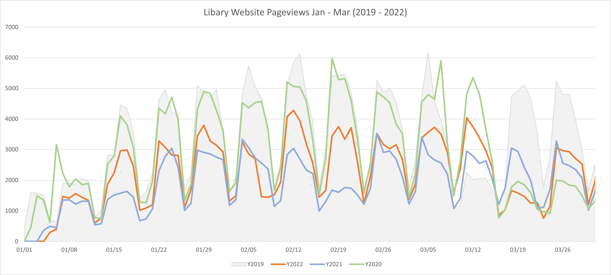

```{r setup, include=FALSE}
knitr::opts_chunk$set(echo = FALSE, message=FALSE,warning=FALSE, cache=TRUE)

#install.packages("pivottabler")
library(tidyverse)
library(pivottabler)
```


# OA Stats
This section is to track the OA status and citation counts of publications by the Tech authors with the publication dates from 2016 through 2020. 

```{r 2022-March-data-as-baseline}

#---- Prepare March data for analysis ----
scopus_202203_1 <- read_csv("data/scopus_2016_20220301.csv")
scopus_202203_2 <- read_csv("data/scopus_2017_20220301.csv")
scopus_202203_3 <- read_csv("data/scopus_2018_20220301.csv")
scopus_202203_4 <- read_csv("data/scopus_2019_20220301.csv")
scopus_202203_5 <- read_csv("data/scopus_2020_20220301.csv")

# combine all the 5 files into 1
scopus_2022_march <- rbind(scopus_202203_1, scopus_202203_2, scopus_202203_3, scopus_202203_4, scopus_202203_5)
rm(scopus_202203_1, scopus_202203_2,scopus_202203_3,scopus_202203_4,scopus_202203_5)

# select only columns relevant
scopus_2022_march <- scopus_2022_march[c(1,3,4,5,12,13,15:17,19)]

#rename columns
names(scopus_2022_march)[c(1:10)] <- c("author", "title", "year", "source_title", "citations_2022_march", "DOI", "doc_type", "pub_stage", "oa_status_2022_march", "EID")

# Replace NAs in citations and OA status, remove rows with missing or duplicated DOIs
scopus_2022_march <- scopus_2022_march %>% 
  replace_na(list(oa_status_2022_march = "Closed", citations_2022_march = 0)) %>% 
  filter(!is.na(DOI)) %>% 
  filter(!DOI %in% DOI[duplicated(DOI)])

```


## 2023 February
Data was retrieved from Scopus on February 1st, 2023. 


```{r, 2023-February-data-preparation}

# read February data
scopus_2023_february <- read_csv("data/scopus_20230201.csv")


# select only columns relevant
scopus_2023_february <- scopus_2023_february[c(1,3,4,5,12,13,15:17,19)]

# rename columns
names(scopus_2023_february)[c(1:10)] <- c("author", "title", "year", "source_title", "citations_2023_february", "DOI", "doc_type", "pub_stage", "oa_status_2023_february", "EID")


# Replace NAs in citations and OA status, remove rows with missing or duplicated DOIs
scopus_2023_february <- scopus_2023_february %>% 
  replace_na(list(oa_status_2023_february = "Closed", citations_2023_february = 0)) %>% 
  filter(!is.na(DOI)) %>% 
  filter(!DOI %in% DOI[duplicated(DOI)]) %>% 
  write_csv("data_intermediate/scopus_2023_february.csv")

# read January data
scopus_2023_january <- read_csv("data_intermediate/scopus_2023_january.csv")


# records removed from 2022 March
removed_202302 <- anti_join(scopus_2022_march, scopus_2023_february, by = "DOI") 
removed_202302 <- removed_202302%>%
  select(source_title, year, pub_stage, oa_status_2022_march, DOI) %>% 
  arrange(source_title) %>% 
  write_csv("data_intermediate/removed_202302.csv")

# new records in 2023 February
added_202302 <- anti_join(scopus_2023_february, scopus_2022_march, by = "DOI") 

added_202302 <- added_202302 %>% 
  select(source_title, year, pub_stage, oa_status_2023_february, DOI) %>%
  arrange(source_title)

# shared items of 2023 January and 2023 February
main_202302 <- inner_join(scopus_2023_january, scopus_2023_february, by = "DOI")
main_202302 <- main_202302[-c(11:14, 16, 17, 19)]

names(main_202302)[c(1:12)] <- c("author", "title", "year", "source_title", "citations_2023_january", "DOI", "doc_type", "pub_stage", "oa_status_2023_january", "EID", "citations_2023_february", "oa_status_2023_february")
```
* Number of records (Comparing with 2022 March)
  After removing records with missing DOIs or duplicated DOIs, **9,888 records** were kept. **60 items** were removed from the data set of March and **134 items** were added. The total data change was **around 2.0%**.
  
* OA Status (Comparing with 2022 December)
  * Comparing with 2023 January, the OA status of **79 items** changed. 14 OA items turned to be closed; while 24 items became open access. 
  * **12 items turned green where 4 of them were closed items in January**. 5 items lost their green status.

```{r, 2023-February-findings}

#---- Findings - OA Status ----

oa_status_change_202302 <- main_202302 %>% 
  select(title, source_title, year, oa_status_2023_january, oa_status_2023_february, DOI) %>%
  filter(main_202302$oa_status_2023_january != main_202302$oa_status_2023_february) %>% 
  arrange(source_title) 

open2close_202302 <- oa_status_change_202302 %>% 
  filter(oa_status_2023_february == "Closed") %>% 
  write_csv("data_intermediate/open2close_202302.csv")

close2open_202302 <- oa_status_change_202302 %>% 
  filter(oa_status_2023_january == "Closed")

# close2green_10 <- oa_status_change_10 %>% 
#   filter(oa_status_september == "Closed" & oa_status_october == "All Open Access, Green") %>% 
#   write_csv("data_intermediate/close2green_10.csv")


close2green_202302 <- oa_status_change_202302 %>% 
  filter(oa_status_2023_january == "Closed" & str_detect(oa_status_2023_february, "Green")) %>% 
  write_csv("data_intermediate/close2green_202302.csv")

  
green_added_202302 <- oa_status_change_202302 %>% 
  filter(!str_detect(oa_status_2023_january, "Green") & str_detect(oa_status_2023_february, "Green"))

green_removed_202302 <- oa_status_change_202302 %>% 
  filter(str_detect(oa_status_2023_january, "Green") & !str_detect(oa_status_2023_february, "Green"))
```

Publications by Year & by OA Status (Data Retrieved on February 1st, 2023)
```{r, 2023-February-OA-status}

# OA status in 2023 February
main_202302 %>% 
  separate(oa_status_2023_february, c("is_oa", "oa_status", "ex_green"), sep = ", ") %>% 
  replace_na(list(oa_status = "Closed")) %>% 
  group_by(year) %>% 
  count(is_oa, oa_status) %>% 
  mutate(percent = 100*n/sum(n)) %>% 
  ungroup() %>% 
  qhpvt(
    c("is_oa","oa_status"), 
    "year", 
    c("Count" = "sum(n)", "%" = "sum(percent)"),
    formats = list("%.0f", "%.2f"),
    totals = list("is_oa" = "Total", "oa_status" = "Total"),
    totalStyle = list("font-weight"="bold")
    )
```
* Citations
  * Comparing with 2023 January, **2,030 items** obtained more citations.
  * Citations per paper(CpP) for OA publications was **35.29** while for closed publications was **around 12.83**. 

```{r, 2023-February-citations}


# Citations in 2023 February
citations_change_202302 <- main_202302 %>% 
  select(title, source_title, year, citations_2023_january, citations_2023_february) %>% 
  filter(citations_2023_february - citations_2023_january != 0) %>% 
  mutate(citations_diff = citations_2023_february - citations_2023_january, 
         citations_percentage = ifelse(
           citations_2023_january != 0, (citations_2023_february - citations_2023_january)*100 / citations_2023_january, ifelse(citations_2023_january == 0, NA, 999))) %>% 
  arrange(desc(citations_diff), desc(citations_percentage))

citations_error_202302 <- citations_change_202302 %>% 
  select(title, source_title, year, citations_2023_january, citations_2023_february, citations_diff) %>%
  filter(citations_diff < 0)

citations_per_paper_202302 <- main_202302 %>%
  separate(oa_status_2023_february, c("is_oa", "oa_status", "ex_green"), sep = ", ") %>% 
  replace_na(list(oa_status = "Closed")) %>% 
  group_by(is_oa) %>% 
  mutate(CpP_202302 = sum(citations_2023_february)/n())

```
Citations by Year & by OA Status (Data Retrieved on February 1st, 2023)

```{r, 2023-February-citations-per-paper}


# Citations per Paper in 2023 February
main_202302 %>% 
  separate(oa_status_2023_february, c("is_oa", "oa_status", "ex_green"), sep = ", ") %>% 
  replace_na(list(oa_status = "Closed")) %>% 
  group_by(year, oa_status) %>% 
  mutate(citations_per_paper = round(sum(citations_2023_february)/n())) %>%   # added a new column the citations per paper
  select(year, is_oa, oa_status, citations_2023_february, citations_per_paper) %>%  
  ungroup() %>%  
  qhpvt(
    c("is_oa", "oa_status"), 
    "year", 
    c("Count" = "n()", "CpP" = "sum(citations_per_paper)/n()"),
    formats = list("%.0f", "%.0f"),
    totals = list("oa_status" = "Total", "Year" = "Total"),
    totalStyle = list("font-weight"="bold")
    )
```


## 2023 January
Data was retrieved from Scopus on January 2nd, 2023. 


```{r, 2023-January-data-preparation}

# read January data
scopus_2023_january <- read_csv("data/scopus_20230102.csv")


# select only columns relevant
scopus_2023_january <- scopus_2023_january[c(1,3,4,5,12,13,15:17,19)]

# rename columns
names(scopus_2023_january)[c(1:10)] <- c("author", "title", "year", "source_title", "citations_2023_january", "DOI", "doc_type", "pub_stage", "oa_status_2023_january", "EID")


# Replace NAs in citations and OA status, remove rows with missing or duplicated DOIs
scopus_2023_january <- scopus_2023_january %>% 
  replace_na(list(oa_status_2023_january = "Closed", citations_2023_january = 0)) %>% 
  filter(!is.na(DOI)) %>% 
  filter(!DOI %in% DOI[duplicated(DOI)]) %>% 
  write_csv("data_intermediate/scopus_2023_january.csv")

# read December data
scopus_2022_december <- read_csv("data_intermediate/scopus_december.csv")


# records removed from 2022 March
removed_202301 <- anti_join(scopus_2022_march, scopus_2023_january, by = "DOI") 
removed_202301 <- removed_202301%>%
  select(source_title, year, pub_stage, oa_status_2022_march, DOI) %>% 
  arrange(source_title) %>% 
  write_csv("data_intermediate/removed_202301.csv")

# new records in 2023 January
added_202301 <- anti_join(scopus_2023_january, scopus_2022_march, by = "DOI") 

added_202301 <- added_202301 %>% 
  select(source_title, year, pub_stage, oa_status_2023_january, DOI) %>%
  arrange(source_title)

# shared items of 2022 December and 2023 January
main_202301 <- inner_join(scopus_2022_december, scopus_2023_january, by = "DOI")
main_202301 <- main_202301[-c(11:14, 16, 17, 19)]

names(main_202301)[c(1:12)] <- c("author", "title", "year", "source_title", "citations_2022_december", "DOI", "doc_type", "pub_stage", "oa_status_2022_december", "EID", "citations_2023_january", "oa_status_2023_january")
```
* Number of records (Comparing with 2022 March)
  After removing records with missing DOIs or duplicated DOIs, **9,888 records** were kept. **60 items** were removed from the data set of March and **129 items** were added. The total data change was **around 1.9%**.
  
* OA Status (Comparing with 2022 December)
  * Comparing with 2022 December, the OA status of **92 items** changed. 26 OA items turned to be closed; while 18 items became open access. 
  * **11 items turned green where 9 of them were closed items in December 2022**. 9 items lost their green status.

```{r, 2023-January-findings}

#---- Findings - OA Status ----

oa_status_change_202301 <- main_202301 %>% 
  select(title, source_title, year, oa_status_2022_december, oa_status_2023_january, DOI) %>%
  filter(main_202301$oa_status_2022_december != main_202301$oa_status_2023_january) %>% 
  arrange(source_title) 

open2close_202301 <- oa_status_change_202301 %>% 
  filter(oa_status_2023_january == "Closed") %>% 
  write_csv("data_intermediate/open2close_202301.csv")

close2open_202301 <- oa_status_change_202301 %>% 
  filter(oa_status_2022_december == "Closed")

# close2green_10 <- oa_status_change_10 %>% 
#   filter(oa_status_september == "Closed" & oa_status_october == "All Open Access, Green") %>% 
#   write_csv("data_intermediate/close2green_10.csv")


close2green_202301 <- oa_status_change_202301 %>% 
  filter(oa_status_2022_december == "Closed" & str_detect(oa_status_2023_january, "Green")) %>% 
  write_csv("data_intermediate/close2green_202301.csv")

  
green_added_202301 <- oa_status_change_202301 %>% 
  filter(!str_detect(oa_status_2022_december, "Green") & str_detect(oa_status_2023_january, "Green"))

green_removed_202301 <- oa_status_change_202301 %>% 
  filter(str_detect(oa_status_2022_december, "Green") & !str_detect(oa_status_2023_january, "Green"))
```

Publications by Year & by OA Status (Data Retrieved on January 2nd, 2023)
```{r, 2023-January-OA-status}

# OA status in 2023 January
main_202301 %>% 
  separate(oa_status_2023_january, c("is_oa", "oa_status", "ex_green"), sep = ", ") %>% 
  replace_na(list(oa_status = "Closed")) %>% 
  group_by(year) %>% 
  count(is_oa, oa_status) %>% 
  mutate(percent = 100*n/sum(n)) %>% 
  ungroup() %>% 
  qhpvt(
    c("is_oa","oa_status"), 
    "year", 
    c("Count" = "sum(n)", "%" = "sum(percent)"),
    formats = list("%.0f", "%.2f"),
    totals = list("is_oa" = "Total", "oa_status" = "Total"),
    totalStyle = list("font-weight"="bold")
    )
```
* Citations
  * Comparing with 2022 December, **2,110 items** obtained more citations.
  * Citations per paper(CpP) for OA publications was **34.81** while for closed publications was **around 12.56**. 

```{r, 2023-January-citations}


# Citations in 2023 January
citations_change_202301 <- main_202301 %>% 
  select(title, source_title, year, citations_2022_december, citations_2023_january) %>% 
  filter(citations_2023_january-citations_2022_december != 0) %>% 
  mutate(citations_diff = citations_2023_january - citations_2022_december, 
         citations_percentage = ifelse(
           citations_2022_december != 0, (citations_2023_january - citations_2022_december)*100 / citations_2022_december, ifelse(citations_2022_december == 0, NA, 999))) %>% 
  arrange(desc(citations_diff), desc(citations_percentage))

citations_error_202301 <- citations_change_202301 %>% 
  select(title, source_title, year, citations_2022_december, citations_2023_january, citations_diff) %>%
  filter(citations_diff < 0)

citations_per_paper_202301 <- main_202301 %>%
  separate(oa_status_2023_january, c("is_oa", "oa_status", "ex_green"), sep = ", ") %>% 
  replace_na(list(oa_status = "Closed")) %>% 
  group_by(is_oa) %>% 
  mutate(CpP_202301 = sum(citations_2023_january)/n())

```
Citations by Year & by OA Status (Data Retrieved on January 2nd, 2023)

```{r, 2023-January-citations-per-paper}


# Citations per Paper in 2023 January
main_202301 %>% 
  separate(oa_status_2023_january, c("is_oa", "oa_status", "ex_green"), sep = ", ") %>% 
  replace_na(list(oa_status = "Closed")) %>% 
  group_by(year, oa_status) %>% 
  mutate(citations_per_paper = round(sum(citations_2023_january)/n())) %>%   # added a new column the citations per paper
  select(year, is_oa, oa_status, citations_2023_january, citations_per_paper) %>%  
  ungroup() %>%  
  qhpvt(
    c("is_oa", "oa_status"), 
    "year", 
    c("Count" = "n()", "CpP" = "sum(citations_per_paper)/n()"),
    formats = list("%.0f", "%.0f"),
    totals = list("oa_status" = "Total", "Year" = "Total"),
    totalStyle = list("font-weight"="bold")
    )
```


# Web Stats

Comparing Jan and Feb of the four years from 2019 to 2022

## Google Analytics

### March

#### Overview

The page views of the **study spaces page** have **tripled to nearly 10,000 since 2019**. The mobile visits increased from 1,000 to about 5,000 now. **The mobile usage takes almost half of the page views of this page**. 

Comparing with the pandemic time, Jan through March of 2021(blue line), the website visits **increased around 20% in 2022**. The current page views are still **20-30% lower than those before the COVID-19**. 

<br>


*Note*

* The page views of library website fluctuate on a weekly basis. The x-axis uses the date of the year 2022. The page views of other year are switched to match the fluctuation and demo the differences by year.
* The second half week of 02/05 in 2022 and the week of 02/19 in 2021, the city was hit by winter storms and the campus was closed.
* The week of 03/12 in 2019 and the week of 03/19 in 2020 & 2022 were spring breaks. 

#### Organic search vs Direct visit
* For the most visited pages like study space, ETD, books, personal librarians, doc del, and accounts, over 65% of visits came from organic searches. 

#### Desktop vs Mobile
* Most pages are still viewed on desktops. 
* Certain pages have obtained more mobile users. The mobile views of the parking and Wi-Fi pages have increased from around 65% to 77% since 2019.
* The use of tablets seems declining.

### Feb
**The overall usage of website increases comparing with the same time period of 2021, but has not come back to the level of 2019 and 2020 (pre-pandemic). **

**Home page clicks - The label [object HTMLDivElement]tab_overlay[object Object] takes over 7% of the clicks but I could not identify the element. Probably this label is for some spots on the search boxes. If true, the search box area got over 60% of the clicks. Need to follow up with this label. **


* Browsers: 65-70% sessions used Chrome; usage of Safari was slightly increased
* Channels: The percentage of sessions which came through organic searches increased from 43% to 60% in 2021 and 58% in 2022. Even before COVID-19, use of organic search was increasing. The pandemic accelerated this trend. 
* Devices: Sessions using desktop have gradually moved to mobile during 2019 through 2021. But 2022 witnessed a jump from 9% to 13% in mobile and a drop from 90% to 84% in desktop. Will follow up to see if it is a new trend. 

```{r, Feb-GA}
# # library(tidyverse)
# # library(pivottabler)
# 
# pageviews <- read_csv("data/pageviews.csv")
# 
# ## pageviews %>% 
# ##   qhpvt("Name", "Year", "sum(Pageviews)")
# 
# 
# pt <- PivotTable$new()
# pt$addData(pageviews)
# pt$addColumnDataGroups("Year")
# pt$addRowDataGroups("Name", 
#                     outlineTotal=list(groupStyleDeclarations=list(color="black")))
# pt$defineCalculation(calculationName = "TotalViews", summariseExpression = "sum(Pageviews)")
# pt$sortRowDataGroups(
#   levelNumber = 1,
#   orderBy = "calculation",
#   sortOrder = "desc",
#   calculationGroupName = "default"
# )
# ## pt$asDataFrame()
# pt$renderPivot()


```

## Google Business Profile

* Profile on Google Reviews
  * Oct - 3 reviews received, all were rated 5 stars. 
  * Sep - 3 reviews received, two were 5-star and one was 4-star. The user pointed out that if you don't pick the right elevator, you may get lost. 
  * Aug - No new reviews.
  * Jul - 1 review received, it was rated 5 stars.
  * Jun - 3 reviews received, all were 5-star ratings.
  * May - No new reviews. 
  * Apr - 2 reviews received, both were 5-star ratings.
  * Mar - 5 reviews received, all were 5-star ratings.
  * Jan and Feb - 4 reviews received, two were 5-star and other two reviews were 4-star ratings
* Profile views 
  * Oct - 22,484
  * Sep - 24,465
  * Aug - 16,846
  * Jul - 11,633
  * Jun - 15,007
  * May - 16,669
  * Apr - 22,180
  * Mar - 25,049 
  * Feb - 24,093
  * Jan - 17,910
* Over 70% of the Google searches were preformed on desktop; while the rest were on mobile. The percentage of searches using desktop computers have slightly decreased since last fall.   

